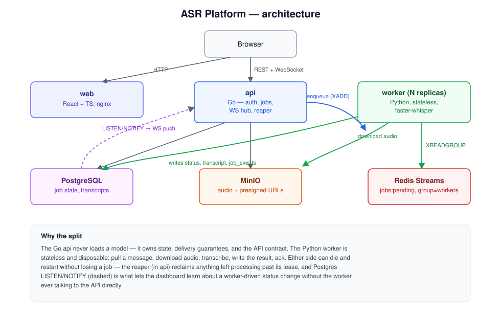

# ASR Platform

Self-hosted, English-only speech-to-text transcription service. Upload
an audio file, watch it queue and transcribe, read the finished
transcript with clickable timestamps — no third-party API in the
critical path.

A Go control plane owns state, delivery guarantees, and the API
contract. Stateless Python workers run `faster-whisper` and can die at
any moment without losing a job. A React dashboard shows job status
updating live over WebSocket, with no page refresh. The whole thing
autoscales on queue depth and ships with real Prometheus metrics and a
Grafana dashboard, not just health checks.


## Architecture



The Go `api` never loads a transcription model; the Python `worker`
never terminates an HTTP request. Full reasoning, the queue's delivery
guarantees, and how the dashboard learns about worker-driven status
changes without the worker ever calling the API: **[docs/architecture.md](docs/architecture.md)**.
Individual design decisions are in **[docs/adr/](docs/adr/)**.

## How data flows through it

1. **Upload.** The browser asks the API for a presigned MinIO URL
   (`POST /uploads`), then `PUT`s the audio file straight to MinIO —
   the file's bytes never pass through the API process. See
   [ADR 0005](docs/adr/0005-presigned-uploads.md) for why.
2. **Create the job.** Once the upload succeeds, the browser calls
   `POST /jobs` with the object key. The API writes a `jobs` row
   (`status = queued`), appends a `job_events` row, and pushes the job
   ID onto a Redis Stream — in that order, so a worker can never see a
   job in the queue before the database agrees it exists.
3. **Claim and transcribe.** A worker reads from the stream via a
   consumer group, downloads the audio from MinIO, and runs
   `faster-whisper` locally. It renews a lease in Postgres periodically
   so a reaper doesn't reclaim the job out from under it while a long
   file is still processing.
4. **Write the result.** On success the worker writes the transcript
   and segment timestamps to Postgres and marks the job `succeeded`
   (or `failed` with a machine-readable `error_code` on failure) — one
   more `job_events` row either way.
5. **Live update, no polling.** Every `job_events` insert fires a
   Postgres `NOTIFY`. The API's WebSocket hub is subscribed via
   `LISTEN` and fans the event straight out to any dashboard tab
   watching that job — the worker never calls the API directly; the
   two only ever communicate through Postgres and Redis.
6. **Read the transcript.** The dashboard's job detail view re-renders
   the moment that WebSocket message arrives: status flips to
   *Succeeded*, the transcript appears with an audio player and
   clickable segment timestamps.

If a worker is killed mid-job (crash, pod eviction, `kill -9`), the
lease in step 3 expires, the reaper flips the job back to `queued`,
and any live worker picks it up again — verified in phases 2 and 4 by
actually killing one. Full version of this walkthrough, plus the
delivery-guarantee reasoning: **[docs/architecture.md](docs/architecture.md)**.

## Running it

### Option A — Kubernetes (recommended, shows the whole system)

```bash
git clone https://github.com/ClairCrest/asr-platform.git && cd asr-platform
cp .env.example .env
make kind-up
```

`make kind-up` builds the three images, creates a local
[`kind`](https://kind.sigs.k8s.io/) cluster, installs ingress-nginx and
KEDA, applies the Kustomize `local` overlay (Postgres, Redis, MinIO,
the API, workers, the dashboard, Prometheus, Grafana), and runs
migrations as an init container — cold to running with one command,
a few minutes the first time while images build.

Once it's done:

- Dashboard: **http://localhost:8080**
- Grafana: `make grafana` (port-forwards to **http://localhost:3000**,
  anonymous viewer access, dashboard pre-provisioned)
- Prometheus: `make prometheus` (port-forwards to **http://localhost:9090**)
- Load test: `make load-test` (k6, drives a 50-job burst and shows
  KEDA scale the worker `Deployment` up and back down)

`make kind-down` deletes the cluster.

Requires Docker, [`kind`](https://kind.sigs.k8s.io/), and `kubectl`.

### Option B — Docker Compose + local processes (faster to start, no Kubernetes)

```bash
git clone https://github.com/ClairCrest/asr-platform.git && cd asr-platform
cp .env.example .env
make up && make migrate-up      # Postgres, Redis, MinIO via Docker Compose
```

Then, **in three separate terminals**, each needs the same `.env` file
exported into its shell first — `go run` and `uv run` don't load
`.env` automatically the way Docker Compose does, so skipping this
step (`set -a && source .env && set +a`) is the single most common
cause of `ERR_CONNECTION_REFUSED`:

```bash
# terminal 1
set -a && source .env && set +a
cd api && go run ./cmd/api

# terminal 2
set -a && source .env && set +a
cd worker && uv run python -m worker.main

# terminal 3 (does not need .env — Vite reads web/.env or falls back
# to VITE_API_URL's default of http://localhost:8080)
cd web && npm install && npm run dev
```

- API health check: `curl http://localhost:8080/healthz` should
  return `200`.
- Dashboard: whatever Vite prints, normally **http://localhost:5173**.
- `make down` stops the Docker Compose services. `make migrate-down`
  reverts the last migration.

Requires Docker, Go 1.23+, Python 3.11+ with [`uv`](https://docs.astral.sh/uv/),
Node.js, and the [`golang-migrate`](https://github.com/golang-migrate/migrate)
CLI (only `migrate-up`/`migrate-down` need it — the `kind-up` path
runs migrations itself).

### Using the dashboard once it's up

1. Go to `/register`, create an account (email + password — single
   user, no orgs or invites in this project).
2. On `/jobs`, pick an audio file and upload it. It appears in the
   table immediately with status `queued`.
3. Click into the job. Status flips to `running` then `succeeded` (or
   `failed`) live, over the same WebSocket connection, with zero
   polling and zero page reloads.
4. Once `succeeded`, the transcript renders below with an inline audio
   player and clickable timestamps — clicking a segment seeks the
   player to that point.

## Tech stack

| Layer | Technology |
|---|---|
| API | Go 1.25, chi/v5, pgx/v5, golang-migrate |
| Worker | Python 3.11+, faster-whisper (`small.en`, int8), ffmpeg, uv |
| Frontend | TypeScript, React 19, Vite, TanStack Query, react-router, Tailwind |
| Database | PostgreSQL 16 |
| Queue | Redis Streams with consumer groups |
| Object storage | MinIO (S3-compatible) |
| Realtime | WebSocket, fed by Postgres `LISTEN`/`NOTIFY` |
| Local orchestration | Docker Compose |
| Cluster | Kubernetes via kind, Kustomize (base + local/cloud overlays) |
| Autoscaling | KEDA on Redis Stream backlog, CPU-based HPA fallback |
| Observability | `log/slog` JSON, Prometheus, Grafana, k6 load testing |
| Quality | golangci-lint, ruff, oxlint, pytest, go test |

`internal/store/db` is hand-written to match what `sqlc` would generate
rather than actually generated — the dev sandbox this was built in has
no working `cgo` toolchain, which `sqlc` needs. `sqlc.yaml` and
`internal/store/queries/*.sql` are still the intended source of truth;
see [ADR 0001](docs/adr/0001-hand-written-store-layer.md).

## What this is not

- No model fine-tuning — inference only, on a pretrained English model.
- No Thai or multilingual support. English audio only, and the
  dashboard says so with a visible warning when a transcript's detected
  language confidence drops below 50%, rather than silently returning a
  transcript that might be wrong.
- No speaker diarization, streaming transcription, billing, or
  multi-tenant orgs in v1 — see [`ASR-PLATFORM-PLAN.md`](./ASR-PLATFORM-PLAN.md#9-future-work-to-list-in-the-readme-not-to-build)
  for the full list of what's deliberately out of scope.

## Verified, not just built

Every phase of this project was checked against a real running system,
not just "the code compiles" — and where that surfaced a real bug, the
bug and the fix are in the corresponding commit and, for the
architecture-level ones, in `docs/adr/`. A few examples:

- A 50-job burst against a real `kind` cluster scaled the worker
  Deployment 1→8→1 via KEDA, drained the queue in 76.3s, and held a
  submission p95 of 820ms — see [`docs/benchmarks.md`](docs/benchmarks.md)
  and the Grafana panel it links.
- Force-killing a worker pod mid-transcription, twice — once locally in
  phase 2, once against Kubernetes in phase 4 — and confirming the
  reaper requeued the job and a replacement worker finished it, with the
  correct transcript intact.
- A real headless-browser run of the full register → upload →
  transcribe → view-transcript flow, with zero console errors, is what
  the GIF above actually is — not a mockup.

## Repository layout

```
api/      Go control plane (auth, jobs, queue, WebSocket hub, metrics)
worker/   Python transcription worker (faster-whisper)
web/      Vite + React + TypeScript dashboard
deploy/   Kubernetes manifests (Kustomize) + k6 load test
docs/     architecture notes, ADRs, benchmarks
```

## License

MIT — see [`LICENSE`](./LICENSE).
