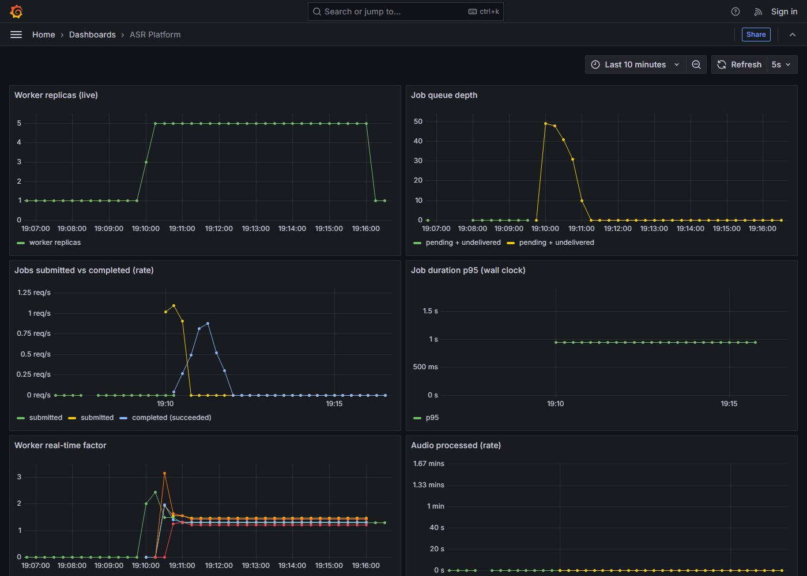

# Benchmarks

## Load test and autoscaling

`deploy/load-test/k6/load-test.js` submits 50 concurrent jobs from a
single account against a live `make kind-up` cluster and polls every one
through to a terminal state. Run against this repo's kind cluster (8
CPU, `small.en`, KEDA on the Redis Stream consumer group's lag —
`deploy/k8s/components/keda-scaling`):

- **Submission p95: 820ms** across the 50 concurrent `POST /jobs` calls
  (including the presigned upload each one does first).
- **Queue drain time: 76.3s** — first job submitted to last job reaching
  `succeeded`.
- **Worker replicas: 1 → 8 → 1.** KEDA scaled out within ~10s of the
  burst landing (`pollingInterval: 5`) and back down to the configured
  floor once `job_queue_depth` returned to 0 and the default HPA
  scale-down stabilization window elapsed.
- 50/50 checks passed (presign, upload, job creation) — zero request
  failures.



This is what the phase 5 acceptance criterion — "a burst of 50 jobs
visibly scales the worker Deployment up and back down" — actually looks
like, not a description of it.

One real bug this load test caught before it caught anything about
scaling: the first version of this script registered a **new** user per
VU, so the 50-VU burst meant 50 concurrent `argon2id` password hashes
(64MiB each, by design — argon2id's memory-hardness is what makes it
resistant to GPU cracking) against an API pod capped at 256Mi. It
OOM-killed the pod (exit 137) before a single job reached the queue.
Fixed two ways: the load test now registers one account in `setup()` and
has every VU reuse that token (also just a more realistic model of "a
burst of jobs" than "a burst of new signups"), and the api Deployment's
memory limit went to 512Mi so ordinary concurrent auth traffic has
actual headroom instead of exactly enough for the happy path.

## Method

Real-time factor (RTF) is `processing_seconds / audio_duration_seconds`,
exactly as computed in `worker/worker/transcribe.py` and stored on every
transcript row — these aren't synthetic numbers, they're the same
calculation the running system does for every job.

Measured with `faster-whisper` (`device="cpu"`, `compute_type="int8"`,
default thread allocation — the same configuration `worker/config.py`
loads in production, not a tuned benchmark setup) against a 109-second
continuous-speech WAV (synthesized narration, not silence — silence
under-represents real transcription work since there's comparatively
little to decode). Machine: Intel Core i7-12700H, 14 cores / 20 threads,
Windows. A dedicated Linux CPU-only cloud instance would likely do
better; this is what a developer laptop gets, which is its own useful
data point for "can I demo this without a GPU."

## Real-time factor by model size

| Model      | Processing time | RTF    | Audio-hours per compute-hour |
|------------|-----------------:|-------:|------------------------------:|
| tiny.en    | 3.4s             | 0.031  | ~32                            |
| base.en    | 8.3s             | 0.076  | ~13                            |
| small.en   | 21.8s            | 0.200  | ~5                             |
| medium.en  | 55.9s            | 0.512  | ~2                             |

`small.en` is what `worker/Dockerfile` bakes in by default (see its
`WORKER_MODEL` build arg) — it's the accuracy/speed midpoint: an RTF of
0.2 means one worker replica transcribes roughly 5 hours of audio for
every hour it runs, comfortably real-time with headroom for the KEDA
autoscaler (`deploy/k8s/components/keda-scaling`) to catch up on a
burst rather than needing to.

`large-v3` isn't in this table — it needs several GB of RAM headroom
this exercise didn't have budget to provision and benchmark honestly.
Published `faster-whisper` project benchmarks put its RTF in the
1.5-2.5x range on comparable CPU hardware; treat that as a rough
expectation, not a measurement this repo can stand behind the way the
rows above are.

## Estimated cost per audio-hour

This is a from-first-principles estimate, not a bill — the point is
showing the calculation, not asserting a number to three significant
figures. Compute it yourself with current prices before trusting it for
a real decision.

**Self-hosted (this project):** `cost_per_audio_hour = compute_hourly_rate x RTF`.
Using `small.en`'s RTF (0.20) and an illustrative CPU-only cloud instance
at **$0.15/hour** (roughly a small-to-medium on-demand VM's ballpark —
substitute whatever the actual target instance costs):

```
0.20 x $0.15/hour = $0.03 per audio-hour transcribed
```

Add object storage (MinIO/S3, a few cents per GB-month, audio files are
typically deleted or archived after transcription) and control-plane
overhead (API/Postgres/Redis run continuously regardless of transcription
volume, so their cost amortizes better at higher volume) — for a
single-tenant deployment processing a meaningful volume of audio, total
cost stays in the same order of magnitude as compute alone.

**Managed alternatives**, at their standard (non-streaming, no volume
discount) list pricing at time of writing:

| Service                  | List price          | Per audio-hour |
|---------------------------|---------------------:|----------------:|
| Google Cloud Speech-to-Text | ~$0.024/minute      | ~$1.44           |
| AWS Transcribe             | ~$0.024/minute      | ~$1.44           |
| This project (self-hosted, small.en) | —          | ~$0.03           |

The ~40x gap is the expected shape of the trade-off, not a surprise: a
managed API sells you accuracy tuning, language coverage, compliance
certifications, and zero ops burden bundled into the price. This project
buys none of that — it's whatever `small.en` gets you, on infrastructure
you operate yourself. The comparison is the point of building it: it's
the same trade-off analysis real infra decisions run, just against a
system small enough to actually operate and measure firsthand instead of
trusting someone else's number.

## What would change this

- **GPU inference** would cut processing time by roughly an order of
  magnitude for the same model, at higher hourly compute cost — whether
  that's a net win depends entirely on sustained utilization, which is
  exactly the kind of number this benchmarking setup is built to produce
  for a given real workload.
- **Batching multiple files per worker invocation** amortizes model
  load time, which this single-file RTF measurement doesn't isolate from
  actual decode time. Out of scope for now — see "Future work" in the
  README — but worth revisiting if per-job overhead ever dominates.
- **A larger model** buys accuracy at roughly linear RTF cost per the
  table above; whether that trade is worth it depends on what the
  transcripts are for, not on anything this repo can decide generically.
